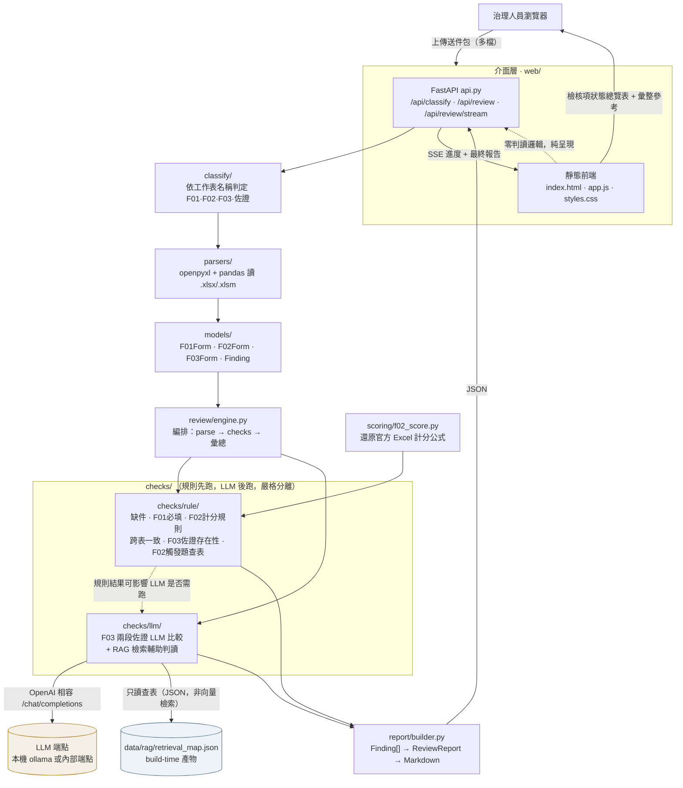
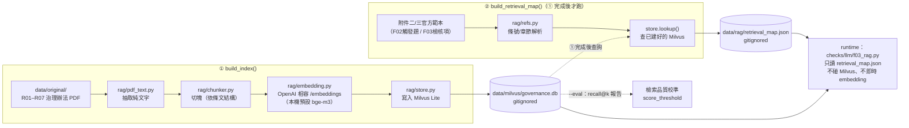
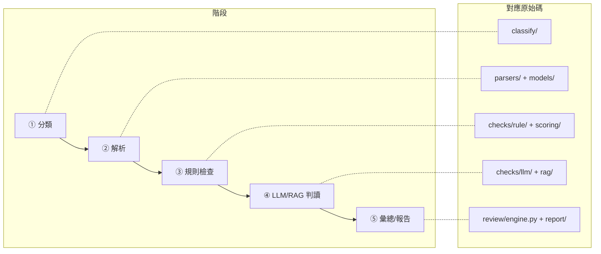
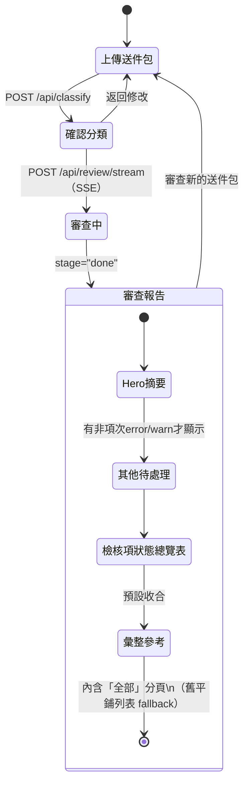

# 架構圖

本文件補充 [README.md](../README.md#架構) 的架構總覽，用圖說明四段管線如何串接、
以及 Web 介面與 build-time RAG 索引兩條「額外」路徑各自怎麼接進主管線。
GitHub 會直接渲染下列 Mermaid 圖；本機看可用支援 Mermaid 的 Markdown 檢視器。

---

## 1. 端到端審查管線（runtime）

治理人員每次上傳送件包，實際會經過的路徑——四段管線 `parsers → models → checks → review.engine → report`
之外，把「介面層」「分類」「LLM/RAG 判讀」也標進來，呈現完整請求生命週期。

**關鍵設計**（對應 `CLAUDE.md` 的行為守則）：

- **規則 / LLM 嚴格分離**：`checks/rule/` 確定性、先跑、可單測、不需網路；`checks/llm/` 判讀、後跑、
  端點不可用時自動降級為單一 INFO finding，**絕不讓規則檢查因 LLM 故障而中斷**。
- **新增 Phase = 新增 Check 類別 + 在 `engine` 註冊**，不動既有程式（見 `checks/base.py` 的 `Check` 介面）。
- **地端不外送**：LLM/RAG 端點皆為環境變數指定的本機或內部位址；`web/` 前端零外部資源（CDN/字型）。
- **runtime 零 Milvus**：`checks/llm/f03_rag.py` 只讀 `data/rag/retrieval_map.json`（build-time 產物），
  **不**在審查當下對 Milvus 做向量檢索——Milvus 只在圖 2 的離線建索引流程裡被寫入/查詢
  （見 `rag/mapping.py` 開頭的模組說明）。

---

## 2. Build-time RAG 索引（獨立於 runtime，另一條管線）

`scripts/build_regulation_index.py` 是**離線**批次工具，產出的索引與映射檔在 runtime 只讀查表，
不在審查當下即時 embedding——這條路徑與圖 1 的 runtime 管線完全分開執行。
`main()` 依序跑兩個**互不相通**的函式——`build_index()` 先把 PDF 切塊寫進 Milvus，
`build_retrieval_map()` 後跑，直接查已寫好的 Milvus 產生 canonical 映射（不會回頭再餵 embedding）：

**為什麼分兩條映射路徑**：F02 觸發題與 F03 檢核項的條文對應多半是**官方範本已內建的固定關係**
（curated，`retrieval_map.json` 的主路徑），語意向量檢索（`data/milvus/`）僅在缺 curated 映射時輔助，
`--eval` 可量測兩者 recall@k 差異、校準 `score_threshold`。runtime（`checks/llm/f03_rag.py`）
只讀 `retrieval_map.json` 這個扁平 JSON 檔，**完全不連 Milvus**——見 `rag/mapping.py` 開頭的模組說明
「runtime 零 embedding、零 Milvus」。

---

## 3. 目錄 ↔ 管線階段對照

---

## 4. Web 介面：三步驟狀態機（前端）

`web/app.js` 是純 vanilla JS 狀態機，`#app` 依 `state.step` 全量重繪，事件一律走
`data-action` 委派（見 `web/app.js` 開頭的 `state` 物件）。

> 圖中「審查中」為簡化表示；實作上 `state.step` 在 SSE 期間仍停在 2，由 `state.reviewing=true`
> 觸發全螢幕進度覆蓋層，收到 `stage="done"` 才跳到 `state.step=3`。

**報告頁重點**（2026-07 改版，取代舊版 67 筆平鋪列表）：解析 `F03.LLM_TABLE`/`F03.RAG_TABLE`
兩張彙整表，依**檢核項次**合併成單一狀態總覽表（欄位：項次｜管理議題｜提案佐證｜上線佐證｜
兩段差異｜法規符合｜摘要），問題列標色、可展開查看完整細節；其餘彙整資訊收合到「彙整參考」，
內含舊版平鋪列表作為 fallback，保證所有 finding 仍可被檢視。

---

## 參考

- [README.md](../README.md) — 安裝、使用流程、環境變數總覽
- [docs/milvus_migration.md](milvus_migration.md) — Milvus Lite → Milvus Server 遷移
- `CLAUDE.md`（repo root）— 行為守則、目錄結構權威來源
